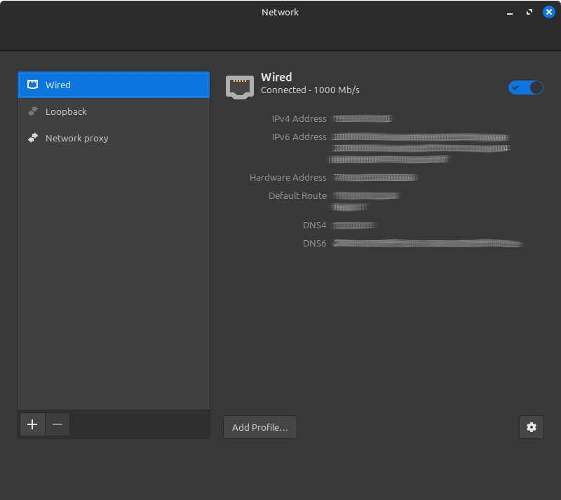
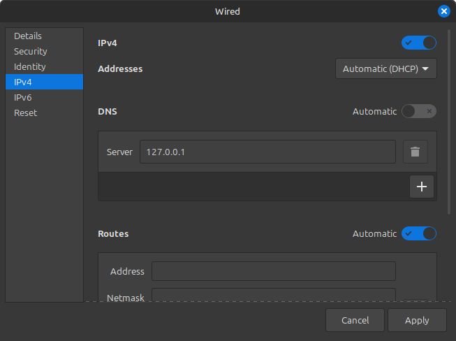
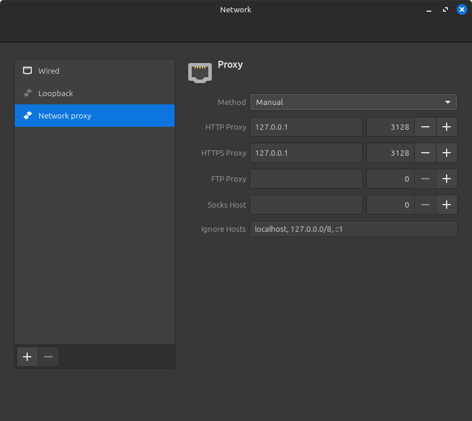

# Proyecto Redes - Configuración de DNS, Servidor Web y Proxy

Este proyecto configura un entorno con tres servicios principales utilizando Docker:
1.  **BIND9**: Servidor DNS para resolver nombres de dominio personalizados.
2.  **Apache**: Servidor web para alojar múltiples sitios virtuales.
3.  **Squid**: Proxy para filtrar el acceso a internet.

## Prerrequisitos

*   **Docker** instalado (Ver [guía de instalación de Docker](https://docs.docker.com/engine/install/))
*   **Docker Compose** instalado (Ver [guía de instalación de Docker Compose](https://docs.docker.com/compose/install/))
*   **Git** (para clonar el repositorio)
*   Un sistema operativo **Linux** para seguir los pasos de prueba.

## Configuración Inicial

1.  **Clonar el repositorio (si aún no lo has hecho):**
    ```bash
    git clone https://github.com/Alegria28/Proyecto-Redes.git
    cd Proyecto-Redes
    ```

## Ejecutar los Servicios

1.  **Levantar los contenedores:**
    Desde la raíz del proyecto (donde se encuentra el archivo `docker-compose.yml`), ejecuta:
    ```bash
    docker compose -f 'docker-compose.yml' up -d --build
    ```
    Esto construirá las imágenes (si es la primera vez o si hay cambios en los Dockerfiles) e iniciará los contenedores en segundo plano.
    
## Probar los Servicios

A continuación, se detallan los pasos para probar cada servicio.

### 1. Probar el Servicio DNS (BIND)

El servidor BIND está configurado para resolver los dominios `local.pagina1.com`, `local.pagina2.com`, y `local.pagina3.com`.

#### a. Configurar DNS en la Máquina Anfitriona

Necesitarás configurar manualmente el DNS en tu máquina anfitriona (host Linux) para que utilice el servidor DNS que se ejecuta en Docker (`127.0.0.1`).

**Ejemplo para Linux Mint (o distribuciones con NetworkManager similar):**

1.  Abre la configuración de Red.
2.  Selecciona tu conexión activa y accede a sus ajustes (normalmente un icono de engranaje).
3.  Ve a la pestaña `IPv4`.
4.  Desactiva el DNS automático.
5.  En el campo de Servidores DNS, añade `127.0.0.1`.
6.  Aplica los cambios.

<table>
  <tr>
    <td align="center"></td>
    <td align="center"></td>
  </tr>
  <tr>
    <td align="center"><em>Paso 1 & 2: Acceder a la configuración de la conexión de red.</em></td>
    <td align="center"><em>Paso 3-5: Configurar el servidor DNS en la pestaña IPv4.</em></td>
  </tr>
</table>

7.  **Reinicia NetworkManager** para que los cambios surtan efecto:
    ```bash
    sudo systemctl restart NetworkManager
    ```

#### b. Verificar la Resolución DNS

Abre una terminal y usa el comando `dig` para consultar cada dominio. El servidor DNS a consultar es `127.0.0.1`.

*   Para `local.pagina1.com`:
    ```bash
    dig local.pagina1.com @127.0.0.1
    ```
*   Para `local.pagina2.com`:
    ```bash
    dig local.pagina2.com @127.0.0.1
    ```
*   Para `local.pagina3.com`:
    ```bash
    dig local.pagina3.com @127.0.0.1
    ```
    En la sección `ANSWER SECTION` de la salida, deberías ver que cada dominio resuelve a `127.0.0.1`.

### 2. Probar el Servicio Web (Apache)

Con la configuración DNS de tu host apuntando a `127.0.0.1` (del paso anterior):

#### a. Acceder a las Páginas Web

Abre tu navegador web y visita las siguientes URLs:
*   `http://local.pagina1.com` (Debería mostrar "Esta es la pagina 1")
*   `http://local.pagina2.com` (Debería mostrar "Esta es la pagina 2")
*   `http://local.pagina3.com` (Debería mostrar "Esta es la pagina 3")

### 3. Probar el Servicio Proxy (Squid)

El proxy Squid se ejecuta en `127.0.0.1` en el puerto `3128`.

#### a. Configurar el Proxy en tu Sistema o Navegador

*   **Opción 1: Navegador (Ejemplo Firefox):**
    1.  Ve a `Preferencias` -> `General`.
    2.  Desplázate hasta `Configuración de red` y haz clic en `Configuración...`.
    3.  Selecciona `Configuración manual del proxy`.
    4.  En `Proxy HTTP`, ingresa `127.0.0.1`.
    5.  En `Puerto` para HTTP Proxy, ingresa `3128`.
    6.  Opcionalmente, marca "Usar este proxy para todos los protocolos" o configura también el proxy HTTPS con los mismos valores.
    7.  Guarda los cambios.

*   **Opción 2: Sistema (Ejemplo Linux Mint):**
    1.  Ve a la configuración de `Red`.
    2.  Selecciona `Proxy de red`.
    3.  Elige el método `Manual`.
    4.  Configura `HTTP Proxy` y `HTTPS Proxy` con la dirección `127.0.0.1` y el puerto `3128`.
    5.  Aplica los cambios.

    
    *<p align="center">Ejemplo de configuración del proxy a nivel de sistema en Linux Mint.</p>*

#### b. Probar el Filtrado

Con el proxy configurado:
*   **Sitio permitido:** Intenta acceder a un sitio web normal que no esté en la lista de prohibidos (ej. `http://example.com`). Debería cargar correctamente.
*   **Sitio prohibido (por dominio):** Intenta acceder a `http://www.facebook.com` o `http://www.youtube.com`. El acceso debería ser bloqueado por Squid.
*   **Palabra prohibida (en URL):** Intenta buscar "juegos" o "casino" en un motor de búsqueda, o intenta acceder a una URL que contenga estas palabras (ej. `http://example.com/pagina-de-juegos.html`). El acceso debería ser bloqueado por Squid.

### 4. Probar las Reglas de Firewall (iptables)

El script `ipTables/ipTablesConf.sh` se ejecuta automáticamente al levantar los servicios con `docker compose up` gracias al servicio `iptables-config` definido en `docker-compose.yml`. Este script modifica las reglas de `iptables` en la máquina anfitriona (host) para controlar el tráfico hacia y desde los contenedores.

**Notas Generales para las Pruebas:**
*   Necesitarás la dirección IP de tu máquina anfitriona (la que ejecuta Docker). En las pruebas, esta se referirá como `<docker_host_ip>`. ¡
*   Algunas pruebas requieren acceso a otras máquinas en tu red local con direcciones IP específicas (ej., `192.168.1.77`) o la capacidad de cambiar la IP/MAC de tu máquina de prueba.
*   Para reglas que bloquean el tráfico saliente de contenedores (ej., a través de `enp4s0`), la interfaz de red `enp4s0` es un ejemplo y podría ser diferente en tu máquina anfitriona (ej., `eth0`, `wlan0`).
*   Algunas reglas se aplican a puertos de servicios (ej., FTP, SSH) que no están configurados por defecto en este proyecto. Para probarlas, necesitarías desplegar un contenedor con dicho servicio y mapear el puerto correspondiente.

#### a. Regla 1: Denegar acceso al puerto 80 (HTTP) desde `192.168.1.77`
*   **Desde una máquina con IP `192.168.1.77`:**
    Intenta acceder al servidor web: `curl http://<docker_host_ip>`
    *   **Resultado Esperado:** La conexión debería fallar (timeout o rechazo).
*   **Desde una máquina con IP diferente (ej. `192.168.1.78`):**
    Intenta acceder al servidor web: `curl http://<docker_host_ip>`
    *   **Resultado Esperado:** Deberías recibir el contenido de `local.pagina1.com` (o la página por defecto del servidor Apache).

#### b. Regla 2: Denegar acceso al puerto 21 (FTP) desde `192.168.1.77`
*   **Nota:** Esta prueba asume que tienes un servicio FTP ejecutándose en un contenedor y mapeado al puerto 21 del host.
*   **Desde una máquina con IP `192.168.1.77`:**
    Intenta conectar al puerto FTP: `telnet <docker_host_ip> 21`
    *   **Resultado Esperado:** La conexión debería fallar.
*   **Desde una máquina con IP diferente:**
    Intenta conectar al puerto FTP: `telnet <docker_host_ip> 21`
    *   **Resultado Esperado:** Deberías ver el banner del servidor FTP o un intento de conexión exitoso.

#### c. Regla 3: Denegar tráfico de salida para el rango de IPs de contenedor `192.168.0.70-192.168.0.160`
*   **Pasos:**
    1.  Identifica la IP del contenedor Apache (o cualquier otro contenedor relevante):
        ```bash
        docker inspect <nombre_o_id_del_contenedor_apache> | grep IPAddress
        ```
    2.  Si la IP del contenedor (ej., `192.168.0.X`) está dentro del rango `192.168.0.70-192.168.0.160`:
        Accede a la shell del contenedor: `docker exec -it <nombre_o_id_del_contenedor_apache> /bin/bash`
        Dentro del contenedor, intenta acceder a un sitio externo: `curl http://example.com` o `ping 8.8.8.8`
        *   **Resultado Esperado:** La conexión debería fallar (timeout, "no route to host", etc.).
*   **Nota:** La interfaz de salida `-o enp4s0` en la regla es la interfaz de red del host. Asegúrate de que coincida con la de tu sistema si es diferente.

#### d. Regla 5: Denegar acceso al puerto 25 (SMTP) desde la MAC `40:1a:58:d5:45:7a`
*   **Nota:** Esta prueba asume que tienes un servicio SMTP (ej. Postfix, Exim) ejecutándose en un contenedor y mapeado al puerto 25 del host.
*   **Desde una máquina con la MAC `40:1a:58:d5:45:7a`:**
    Intenta conectar al puerto 25: `telnet <docker_host_ip> 25`
    *   **Resultado Esperado:** La conexión debería fallar.
*   **Desde una máquina con una MAC diferente:**
    Intenta conectar al puerto 25: `telnet <docker_host_ip> 25`
    *   **Resultado Esperado:** Deberías ver el banner del servidor SMTP o un intento de conexión exitoso.

#### e. Regla 6: Limitar número de conexiones simultáneas a 20
*   **Prueba:** Intenta establecer más de 20 conexiones TCP nuevas simultáneamente al servidor Apache (puerto 80). Puedes usar un script simple o herramientas como `ab` (Apache Benchmark).
    Ejemplo con `curl` en un bucle (ejecutar desde otra máquina o el host):
    ```bash
    for i in $(seq 1 30); do (curl -s -o /dev/null -m 2 http://<docker_host_ip>/ && echo "Conexión $i: Éxito") || echo "Conexión $i: Fallo" & done; wait
    ```
*   **Resultado Esperado:** Las primeras ~20 conexiones podrían tener éxito. Las conexiones subsiguientes deberían ser rechazadas (la regla usa `REJECT --reject-with tcp-reset`, por lo que el cliente debería recibir un reset de TCP).

#### f. Regla 7: Denegar acceso de salida al puerto 443 (HTTPS) para el contenedor con IP `192.168.0.165`
*   **Pasos:**
    1.  Asegúrate de que un contenedor (podría ser necesario configurar uno estáticamente) tenga la IP `192.168.0.165`.
    2.  Accede a la shell de ese contenedor: `docker exec -it <nombre_contenedor> /bin/bash`
    3.  Dentro del contenedor, intenta acceder a un sitio HTTPS externo: `curl https://example.com`
        *   **Resultado Esperado:** La conexión debería fallar.
*   **Nota:** La interfaz de salida `-o enp4s0` en la regla es la interfaz de red del host.

#### g. Regla 8: Permitir acceso al puerto 2222 (SSH) solo desde `192.168.1.200`
*   **Nota:** Esta prueba asume que tienes un servicio SSH ejecutándose en un contenedor (en su puerto 22 interno) y mapeado al puerto 2222 del host. La contraseña es **testpassword**
*   **Desde una máquina con IP `192.168.1.200`:**
    Intenta conectar por SSH: `ssh testuser@<docker_host_ip> -p 2222`
    *   **Resultado Esperado:** Deberías ver el prompt de SSH o establecer una conexión (después de ingresar la contraseña si es necesaria).
*   **Desde una máquina con IP diferente:**
    Intenta conectar por SSH: `ssh testuser@<docker_host_ip> -p 2222`
    *   **Resultado Esperado:** La conexión debería fallar (timeout o rechazo por `iptables` antes de llegar al prompt de SSH).

#### h. Regla 9: Denegar acceso al puerto 23 (Telnet)
*   **Desde cualquier máquina:**
    Intenta conectar al puerto Telnet: `telnet <docker_host_ip> 23`
*   **Resultado Esperado:** La conexión debería fallar. Esto bloquea el acceso a cualquier servicio que pudiera estar mapeado al puerto 23 del host.

#### i. Regla 10: Denegar acceso al puerto 110 (POP3)
*   **Desde cualquier máquina:**
    Intenta conectar al puerto POP3: `telnet <docker_host_ip> 110`
*   **Resultado Esperado:** La conexión debería fallar. Esto bloquea el acceso a cualquier servicio que pudiera estar mapeado al puerto 110 del host.

#### j. Regla 11: Denegar acceso al puerto 143 (IMAP)
*   **Desde cualquier máquina:**
    Intenta conectar al puerto IMAP: `telnet <docker_host_ip> 143`
*   **Resultado Esperado:** La conexión debería fallar. Esto bloquea el acceso a cualquier servicio que pudiera estar mapeado al puerto 143 del host.

## Detener los Servicios

Para detener y eliminar los contenedores definidos en `docker-compose.yml`:
```bash
docker compose down
```
Esto detendrá y eliminará los contenedores y redes pero no las imágenes de estas.

## Limpiar el Entorno

El script `limpiar.sh` está diseñado para limpiar completamente el entorno Docker utilizado por este proyecto. Este script realiza las siguientes acciones:
1. Detiene y elimina todos los contenedores definidos en `docker-compose.yml`.
2. Elimina todas las imágenes Docker creadas.
3. Elimina todos los volúmenes Docker.

Para ejecutarlo, simplemente usa:
```bash
./limpiar.sh
```
**Nota:** Asegúrate de que el script tenga permisos de ejecución. Si no los tiene, puedes otorgarlos con:
```bash
chmod +x limpiar.sh
```

**Advertencia:** Este script eliminará todas las imágenes y volúmenes de Docker en tu sistema, no solo los relacionados con este proyecto.

## Solución de Problemas

*   **Permisos de Docker:** Asegúrate de que tu usuario tiene permisos para ejecutar comandos de Docker. Generalmente, esto se logra añadiendo tu usuario al grupo `docker` (`sudo usermod -aG docker $USER` y luego reiniciando sesión o el sistema) o ejecutando los comandos de Docker con `sudo`.
*   **Puertos Ocupados:** Si los puertos `53` (DNS), `80` (HTTP) o `3128` (Proxy) ya están en uso en tu máquina anfitriona, `docker compose up` fallará. Deberás detener los servicios que estén usando esos puertos o modificar los mapeos de puertos en el archivo `docker-compose.yml` (ej. ` "8080:80"` para mapear el puerto 80 del contenedor al 8080 del host).
    *   Para identificar qué servicio está usando un puerto específico (reemplaza `<PUERTO>` con el número de puerto, ej. 53, 80):
        ```bash
        sudo netstat -tulnp | grep ':<PUERTO>'
        ```
    *   Una vez identificado el servicio, puedes intentar detenerlo. Por ejemplo, si `systemd-resolved` está usando el puerto 53:
        ```bash
        sudo systemctl stop systemd-resolved
        ```
    *   Si es otro servicio, usa su nombre correspondiente con `systemctl stop <nombre-del-servicio>`. Si no es un servicio gestionado por systemd, podrías necesitar usar `kill <PID>` (donde PID es el ID del proceso obtenido del comando `ss` o `netstat`).
    *   **Advertencia:** Detener servicios del sistema puede tener efectos inesperados. Asegúrate de saber qué servicio estás deteniendo. A menudo, `systemd-resolved` es el culpable del puerto 53 en sistemas de escritorio Linux. Para el puerto 80, podrían ser otros servidores web como Apache (`apache2`) o Nginx (`nginx`) instalados localmente.
